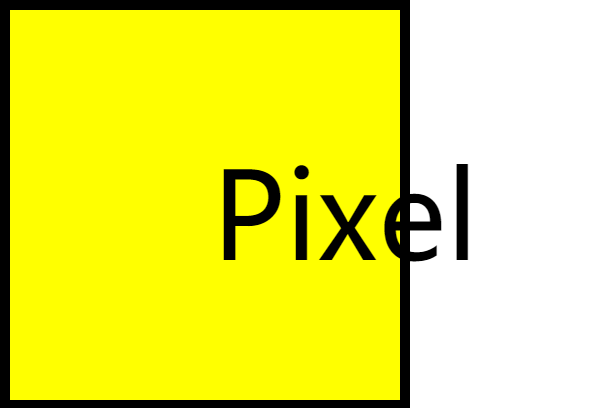

# pixel

<p align="center">
<br><br>
</P>

pixel style CSS framework.


## Install

## Development

```bash
yarn start
```

## Contirbuting


## License

MIT © [diliburong](https://github.com/diliburong)